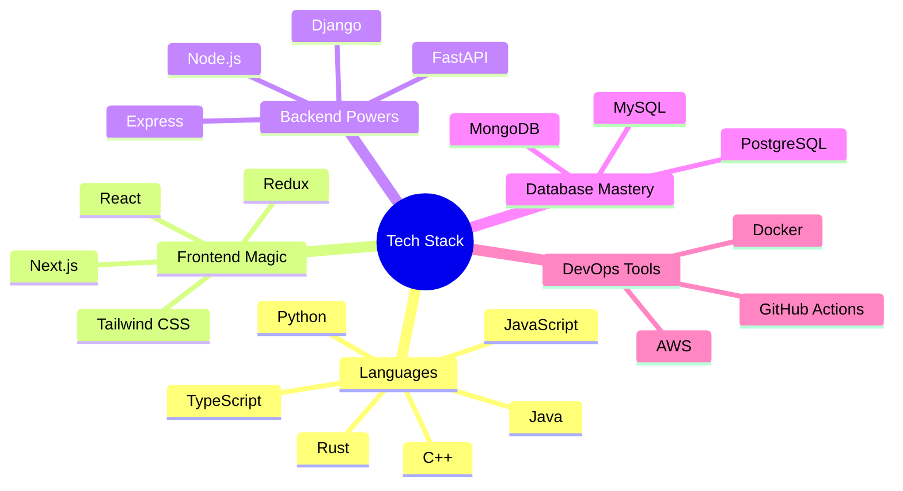

<div align="center">
  
</div>

<div align="center">
  
</div>

```ascii
                     ╔══════════════════════════════════════╗
                     ║        System.out.println(           ║
                     ║    "Hello World, I'm Abhiram! 👋"    ║
                     ╚══════════════════════════════════════╝
```

<div align="center">
  <a href="https://github.com/abhi963007">
    
  </a>
  <a href="https://www.linkedin.com">
    
  </a>
  <a href="mailto:abhiramak963@gmail.com">
    
  </a>
</div>

<br>

<details>
<summary><h2>🎯 My Development Arsenal</h2></summary>
<div align="center">



</div>
</details>

<details>
<summary><h2>🚀 What Drives Me</h2></summary>

```javascript
class SoftwareEngineer {
    constructor() {
        this.name = "Abhiram";
        this.role = "Full Stack Developer";
        this.languageSpoken = ["English", "Code"];
        this.challenges = "Accepted";
    }

    sayHi() {
        console.log("Thanks for dropping by! Let's build something amazing together!");
    }

    getCurrentState() {
        return {
            learning: ["System Design", "Cloud Architecture", "Web3"],
            reading: "Clean Code by Robert C. Martin",
            building: "Scalable Applications",
            exploring: "New Technologies Daily"
        };
    }

    getLifeGoals() {
        return [
            "Contribute to Open Source",
            "Build Impactful Projects",
            "Share Knowledge",
            "Never Stop Learning"
        ];
    }
}
```

</details>

<h2>📊 Development Metrics</h2>

<div align="center">
  
</div>

<div align="center">
  
  
</div>

<h2>🏆 Achievement Showcase</h2>

<div align="center">
  
</div>

<div align="center">
  
</div>

<br>

<div align="center">
  <h2>💡 Random Dev Quote</h2>
  
</div>

<div align="center">
  
</div>

<div align="center">
  
</div>
