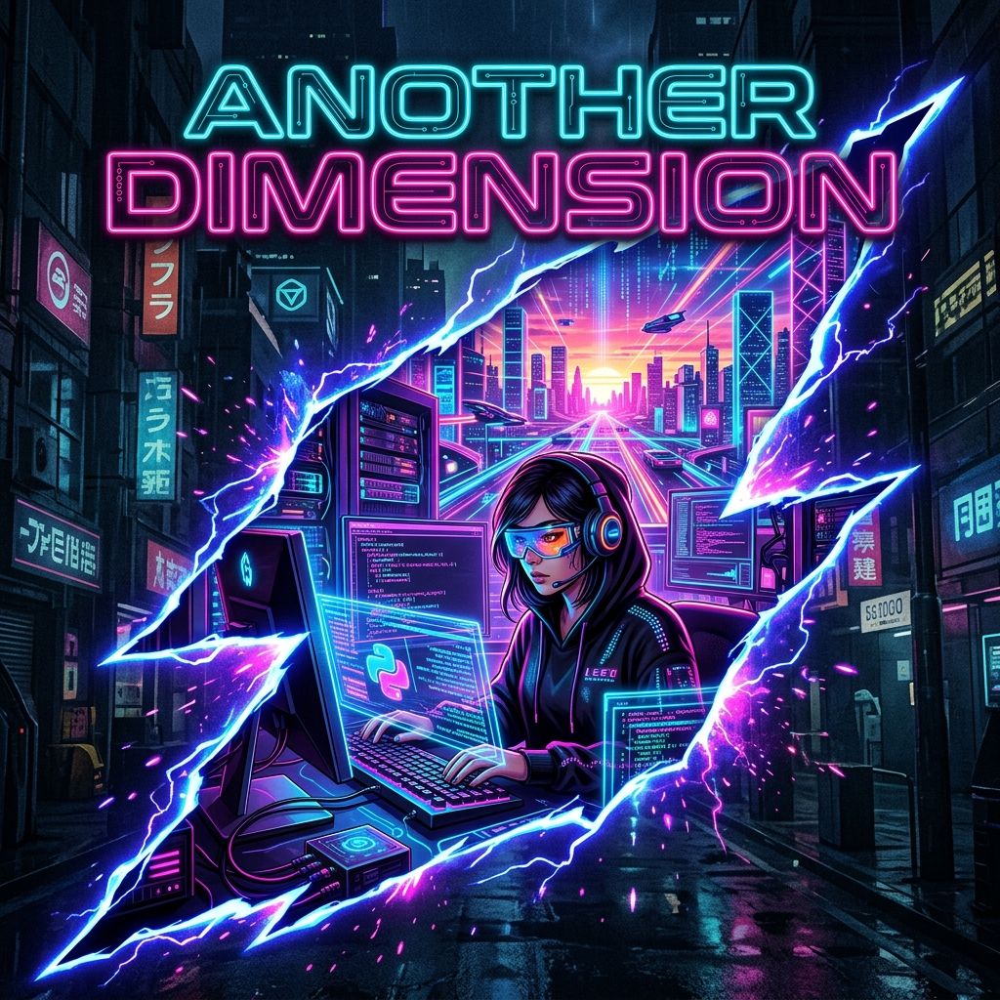
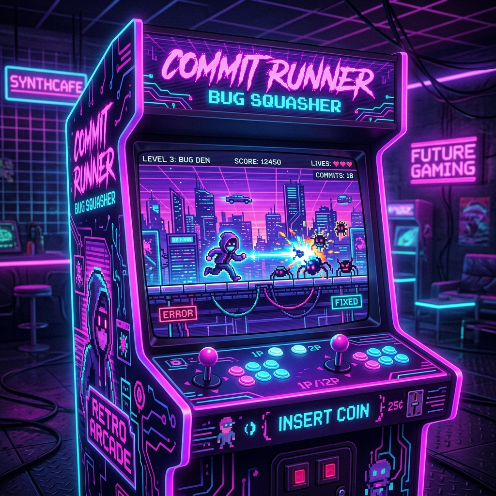

  

<h1 align="center">⚡ ABHIRAM ⚡</h1>

  

  
  
  

---

### 🌌 Developer Manifest
> *"Slicing through complex codes, bridging the gap between imagination and hardware. Welcome to my digital workspace, where logic meets cyber aesthetics."*

---

### 🛠️ Tech Stack & Cyber Systems

| 🎨 **Frontend Interfaces** | ⚙️ **Backend & Engines** | 🐋 **Tools & Environments** |
| :---: | :---: | :---: |
|  |  |  |

---

### 📊 Cyber-Metrics & Diagnostics

  
  

---

### 🎮 Play "Commit Runner: Bug Squasher" on My Profile!

  

  

---

<h3 align="center">🛰️ Connect with Me</h3>

  
  
  

