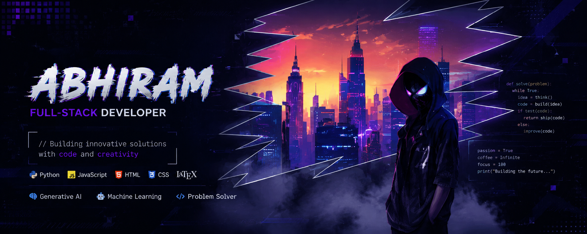
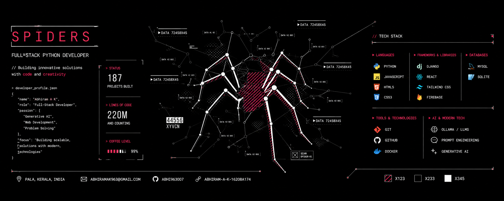

  

<h1 align="center">Friendly Neighborhood Developer</h1>

  

---

  

---

> *"Whatever life holds in store for me, I will never forget these words: **'With great power comes great responsibility.'** This is my gift, my curse. Who am I? I'm Spider-Man."*

---

<h3 align="center">🕸️ Connect via Web-Net</h3>

  <!-- GitHub -->
  
  <!-- LinkedIn -->
  
  <!-- Portfolio -->
  
  <!-- LeetCode -->
  
  <!-- Email -->
  

